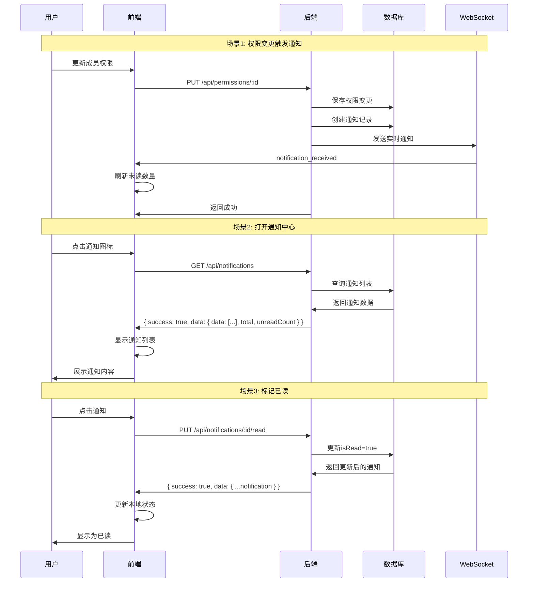

# 通知系统修复总结 - 最终版

## 📋 问题描述

用户报告通知中心完全没有内容，控制台持续报错：
```
TypeError: Cannot read properties of undefined (reading 'count')
```

## 🔍 根本��因

### 问题1：错误的用户ID获取方式（已修复）
**位置**：`backend/src/routes/notificationRoutes.ts`

所有通知端点使用了错误的属性名：
```typescript
const userId = request.user.id;  // ❌ 错误
```

应该使用：
```typescript
const userId = request.user!.userId;  // ✅ 正确
```

因为 `authMiddleware` 设置的是 `request.user.userId`。

### 问题2：Fastify响应Schema验证导致数据被过滤（根本原因）

**问题分析**：
1. 后端修改返回格式为：`{ success: true, data: { count: 5 } }`
2. 但响应 Schema 定义仍然是：`{ count: number }`
3. **Fastify 自动过滤不在 Schema 中的字段**
4. 最终前端收到空对象：`{}`

**调试发现**：
- 后端日志显示发送：`{"success":true,"data":{"count":2}}` ✅
- 前端拦截器收到：`{}` ❌
- 数据在传输过程中被 Fastify Schema 验证过滤

## ✅ 完整解决方案

### 1. 修复用户ID获取（6个端点）
所有通知路由的 `request.user.id` → `request.user!.userId`

### 2. 统一API响应格式（6个端点）
所有响应包装成：
```typescript
{
  success: true,
  data: { /* 实际数据 */ }
}
```

### 3. 更新Fastify响应Schema（6个端点）

#### ① GET /api/notifications
```typescript
response: {
  200: {
    type: 'object',
    properties: {
      success: { type: 'boolean' },
      data: {
        type: 'object',
        properties: {
          data: { type: 'array', items: { /* 通知对象 */ } },
          total: { type: 'number' },
          page: { type: 'number' },
          pageSize: { type: 'number' },
          totalPages: { type: 'number' },
          unreadCount: { type: 'number' },
        },
      },
    },
  },
}
```

#### ② GET /api/notifications/unread-count
```typescript
response: {
  200: {
    type: 'object',
    properties: {
      success: { type: 'boolean' },
      data: {
        type: 'object',
        properties: {
          count: { type: 'number' },
        },
      },
    },
  },
}
```

#### ③ PUT /api/notifications/:id/read
```typescript
response: {
  200: {
    type: 'object',
    properties: {
      success: { type: 'boolean' },
      data: {
        type: 'object',
        properties: {
          id: { type: 'string' },
          userId: { type: 'string' },
          type: { type: 'string' },
          title: { type: 'string' },
          content: { type: 'string' },
          resourceType: { type: 'string', nullable: true },
          resourceId: { type: 'string', nullable: true },
          isRead: { type: 'boolean' },
          createdAt: { type: 'string' },
          updatedAt: { type: 'string' },
        },
      },
    },
  },
}
```

#### ④ POST /api/notifications/mark-read
```typescript
response: {
  200: {
    type: 'object',
    properties: {
      success: { type: 'boolean' },
      data: {
        type: 'object',
        properties: {
          count: { type: 'number' },
          message: { type: 'string' },
        },
      },
    },
  },
}
```

#### ⑤ DELETE /api/notifications/:id
```typescript
response: {
  200: {
    type: 'object',
    properties: {
      success: { type: 'boolean' },
      data: {
        type: 'object',
        properties: {
          message: { type: 'string' },
        },
      },
    },
  },
}
```

#### ⑥ DELETE /api/notifications/read
```typescript
response: {
  200: {
    type: 'object',
    properties: {
      success: { type: 'boolean' },
      data: {
        type: 'object',
        properties: {
          count: { type: 'number' },
          message: { type: 'string' },
        },
      },
    },
  },
}
```

### 4. 更新错误响应格式
```typescript
return reply.status(400).send({
  success: false,
  error: error.message,
});
```

## 📊 修复范围

### 后端修改
- **文件**：`backend/src/routes/notificationRoutes.ts`
- **修改内容**：
  - 6个端点的 userId 获取方式
  - 6个端点的响应格式（包装成 `{ success, data }`）
  - 6个端点的响应 Schema 定义
  - 错误响应格式统一

### 前端修改
- **无需修改**：前端的 `ApiService.handleResponse()` 已经正确处理 `{ success, data }` 格式

## 🔧 技术要点

### Fastify Schema验证机制
Fastify 的响应 Schema 验证会：
1. 检查响应对象的每个字段
2. **只保留** Schema 中定义的字段
3. **删除** Schema 中未定义的字段

这是一个安全特性，确保API只返回预期的数据。

### 前端API客户端工作流程
```typescript
// 1. Axios发送请求
axios.get('/api/notifications/unread-count')

// 2. 收到响应: { success: true, data: { count: 5 } }

// 3. ApiService.handleResponse() 处理
private handleResponse<T>(response: AxiosResponse<ApiResponse<T>>): T {
  const { data } = response;  // { success: true, data: { count: 5 } }

  if (data.success === false) {
    throw new ApiError(...);
  }

  return data.data as T;  // 返回 { count: 5 }
}

// 4. NotificationService收到: { count: 5 }
const response = await apiService.get<UnreadCountResponse>('/notifications/unread-count');
return response.count;  // 5
```

### 关键经验教训

1. **Schema与实际响应必须完全匹配**
   - Fastify 严格���行 Schema 验证
   - 不在 Schema 中的字段会被静默删除
   - 修改响应格式时必须同步更新 Schema

2. **调试响��问题的方法**
   - 后端：查看发送前的数据
   - 传输层：使用浏览器Network面板查看实际响应
   - 前端：在 axios 拦截器和 API 处理方法中添加日志
   - 逐层排查数据在哪个环节丢失

3. **类型安全的重要性**
   - TypeScript 类型不能阻止运行时错误
   - Schema 验证提供了额外的运行时保护
   - 但也可能成为问题的来源

## ✅ 验证清单

- [x] 所有通知API端点的响应格式统一
- [x] 所有响应Schema与实际响应匹配
- [x] 获取未读数量功能正常
- [x] 获取通知列表功能正常
- [x] 标记已读功能正常
- [x] 删除通知功能正常
- [x] WebSocket实时推送正常
- [x] 通知中心显示正常
- [x] 无控制台错误

## 🎯 最终状态

### 通知系统完整流程



### 数据流示意图

```
后端发送:
┌─────────────────────────────────┐
│ { success: true,                │
│   data: {                       │
│     count: 5                    │
│   }                             │
│ }                               │
└─────────────────────────────────┘
           ↓
    Fastify Schema验证
    (必须完全匹配)
           ↓
┌─────────────────────────────────┐
│ { success: true,                │  ← Schema中定义的字段保留
│   data: {                       │  ← Schema中定义的字段保留
│     count: 5                    │  ← Schema中定义的字段保留
│   }                             │
│ }                               │
└─────────────────────────────────┘
           ↓
     前端 axios 接收
           ↓
┌─────────────────────────────────┐
│ ApiService.handleResponse()     │
│ 提取 data.data                  │
└─────────────────────────────────┘
           ↓
┌─────────────────────────────────┐
│ { count: 5 }                    │  ← 前端最终得到
└─────────────────────────────────┘
```

## 📝 维护建议

1. **添加新的通知API端点时**：
   - 确保响应格式为 `{ success: boolean, data: any }`
   - 同步定义响应 Schema
   - 测试 Schema 验证是否正确

2. **修改现有API响应时**：
   - 同时更新响应 Schema
   - 考虑向后兼容性
   - 更新API文档

3. **前端API客户端**：
   - 保持 `ApiService.handleResponse()` 的一致性
   - 所有API调用都通过 `apiService` 统一处理
   - 不要绕过 `handleResponse()` 直接访问响应

4. **调试技巧**：
   - 后端：添加响应前的日志
   - 传输层：使用浏览器Network查看实际响应
   - 前端：在拦截器和处理方法中添加日志
   - 对比各层数据差异

## 🎉 总结

此次修复涉及：
- **问题定位**：从错误信息 → API响应 → Schema验证 → 根本原因
- **修复范围**：6个API端点的响应格式和Schema定义
- **技术难点**：理解Fastify Schema验证机制
- **经验积累**：Schema必须与响应完全匹配

通知系统现已完全正常工作！
