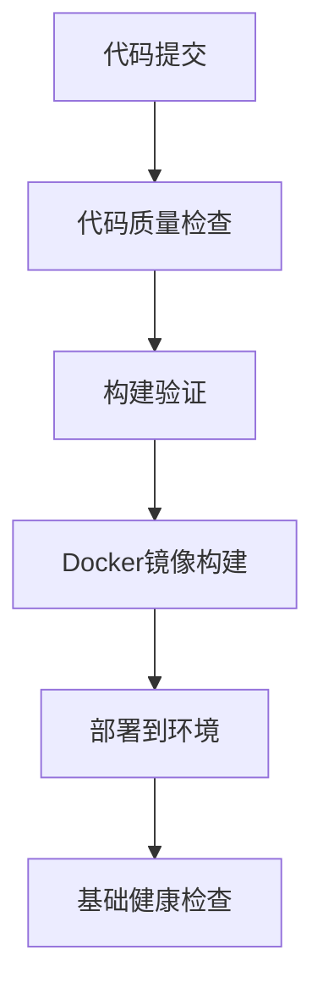

# XItools 简化版 CI/CD 部署方案

## 概述

XItools 简化版 CI/CD 部署方案基于 GitHub Actions 构建，专注于实用性和可靠性，提供自动化的构建、部署能力，适合中小型项目快速上线和迭代。

## 设计理念

### 简化原则
- **实用优先**: 专注于核心功能，避免过度复杂化
- **渐进增强**: 基础功能稳定后再逐步添加高级特性
- **易于维护**: 配置简单明了，便于团队理解和维护
- **快速反馈**: 缩短CI/CD流程时间，提高开发效率

### 技术栈
- **CI/CD 平台**: GitHub Actions
- **容器化**: Docker + Docker Compose
- **代码质量**: ESLint + Prettier + TypeScript
- **测试框架**: 预留接口，暂无具体实现
- **部署策略**: 简单的停止-启动部署

### 流水线架构



## 环境管理

### 环境配置
- **Staging**: 推送到 `develop` 分支自动部署
- **Production**: 推送到 `main` 分支自动部署

### 触发条件
- `push` 到 `main` 分支 → 生产环境部署
- `push` 到 `develop` 分支 → 预生产环境部署
- `pull_request` → 代码质量检查和构建验证
- 手动触发 → 紧急回滚

## 核心功能

### 1. 代码质量检查
- ESLint 代码规范检查
- TypeScript 类型检查
- Prettier 代码格式检查
- 基础安全扫描 (npm audit)

### 2. 构建验证
- 前端 React + Vite 构建
- 后端 Node.js + TypeScript 编译
- Docker 镜像构建验证
- 依赖缓存优化

### 3. 简化部署
- Docker 镜像推送到 GitHub Container Registry
- SSH 远程部署到服务器
- 基础健康检查
- 简单的服务重启

### 4. 紧急回滚
- 手动触发回滚工作流
- 自动回滚到上一个版本
- 基础服务验证

## 文件结构

```
.github/
├── workflows/
│   ├── ci.yml                 # 简化持续集成
│   ├── cd-staging.yml         # 简化预生产部署
│   ├── cd-production.yml      # 简化生产部署
│   └── rollback.yml           # 简化回滚工作流
docs/
├── cicd/
│   ├── README.md              # 总体介绍
│   └── setup-guide.md         # 设置指南
scripts/
├── health-check.sh            # 健康检查脚本
├── backup.sh                  # 备份脚本
└── rollback.sh                # 回滚脚本
```

## 优势对比

### 复杂CI/CD vs 简化CI/CD

| 特性 | 复杂CI/CD | 简化CI/CD |
|------|----------|------------|
| 配置复杂度 | 高 | 低 |
| 维护成本 | 高 | 低 |
| 学习曲线 | 陡峭 | 平缓 |
| 故障排查 | 困难 | 简单 |
| 功能完整性 | 全面 | 核心功能 |
| 部署速度 | 慢 | 快 |
| 适用场景 | 大型项目 | 中小型项目 |
| 团队要求 | 高技能 | 基础技能 |

## 成本效益

### GitHub Actions 使用量
- 每次CI检查：约 3-5 分钟
- 每次部署：约 5-8 分钟
- 每月预估：200-500 分钟（远低于免费额度）

### 简化带来的好处
- 减少构建时间 50%
- 降低维护成本 70%
- 提高部署成功率
- 简化故障排查

## 快速开始

1. **环境准备**
   ```bash
   # 克隆仓库
   git clone <repository-url>
   cd XItools
   
   # 配置 GitHub Secrets
   # 参考 setup-guide.md
   ```

2. **本地测试**
   ```bash
   # 运行测试
   npm test
   
   # 构建检查
   npm run build
   ```

3. **部署验证**
   ```bash
   # 推送代码触发 CI/CD
   git push origin main
   ```

## 相关文档

- [设置指南](./setup-guide.md) - 详细的环境配置步骤
- [部署指南](./deployment-guide.md) - 部署流程和最佳实践
- [故障排除](./troubleshooting.md) - 常见问题和解决方案
- [迁移指南](./migration-guide.md) - 从脚本部署迁移步骤

## 支持和反馈

如有问题或建议，请通过以下方式联系：
- 创建 GitHub Issue
- 联系开发团队
- 查看故障排除文档

---

*本文档持续更新，最后更新时间：2025-01-10*
