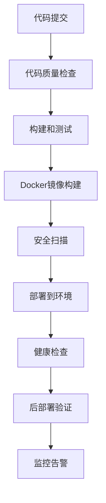

# XItools 企业级 CI/CD 部署方案

## 概述

XItools 企业级 CI/CD 部署方案基于 GitHub Actions 构建，提供自动化的构建、测试、部署和监控能力，替换传统的脚本部署方式，实现更稳定、可维护的企业级解决方案。

## 架构设计

### 技术栈
- **CI/CD 平台**: GitHub Actions
- **容器化**: Docker + Docker Compose
- **代码质量**: ESLint + Prettier + TypeScript
- **测试框架**: Jest (单元测试) + Supertest (集成测试) + Playwright (E2E测试)
- **监控**: Prometheus + Grafana
- **部署策略**: 蓝绿部署 + 滚动更新

### 流水线架构



## 环境管理

### 环境配置
- **Development**: 自动部署，用于开发测试
- **Staging**: 手动批准，用于预生产验证  
- **Production**: 需要审批，生产环境

### 触发条件
- `push` 到 `main` 分支 → 生产环境部署
- `push` 到 `develop` 分支 → 开发环境部署
- `pull_request` → 代码质量检查和测试
- 手动触发 → 紧急部署和回滚

## 核心功能

### 1. 自动化构建
- 前端 React + Vite 构建
- 后端 Node.js + TypeScript 编译
- Docker 多阶段构建优化
- 依赖缓存加速构建

### 2. 全面测试
- 代码质量检查 (ESLint, Prettier)
- TypeScript 类型检查
- 单元测试 (Jest)
- 集成测试 (Supertest)
- 端到端测试 (Playwright)
- 数据库迁移测试

### 3. 安全保障
- 依赖漏洞扫描
- Docker 镜像安全扫描
- 密钥管理 (GitHub Secrets)
- 最小权限原则

### 4. 部署策略
- 零停机部署
- 自动回滚机制
- 健康检查验证
- 数据库迁移管理

### 5. 监控告警
- 应用性能监控
- 错误日志收集
- 资源使用监控
- 部署状态通知

## 文件结构

```
.github/
├── workflows/
│   ├── ci.yml                 # 持续集成
│   ├── cd-staging.yml         # 预生产部署
│   ├── cd-production.yml      # 生产部署
│   └── rollback.yml           # 回滚工作流
docs/
├── cicd/
│   ├── README.md              # 总体介绍
│   ├── setup-guide.md         # 设置指南
│   ├── deployment-guide.md    # 部署指南
│   ├── troubleshooting.md     # 故障排除
│   └── migration-guide.md     # 迁移指南
scripts/
├── health-check.sh            # 健康检查脚本
├── backup.sh                  # 备份脚本
└── rollback.sh                # 回滚脚本
monitoring/
├── prometheus.yml             # Prometheus 配置
├── grafana-dashboard.json     # Grafana 仪表板
└── alert-rules.yml            # 告警规则
```

## 优势对比

### 传统脚本部署 vs CI/CD 部署

| 特性 | 脚本部署 | CI/CD 部署 |
|------|----------|------------|
| 自动化程度 | 半自动 | 全自动 |
| 测试集成 | 手动 | 自动化 |
| 回滚机制 | 复杂 | 一键回滚 |
| 环境一致性 | 难保证 | 容器化保证 |
| 监控告警 | 缺失 | 完整覆盖 |
| 安全性 | 基础 | 企业级 |
| 维护成本 | 高 | 低 |
| 团队协作 | 困难 | 标准化 |

## 成本效益

### GitHub Actions 免费额度
- 公共仓库：无限制
- 私有仓库：每月 2000 分钟
- 存储：500MB

### 预估使用量
- 每次完整构建：约 10-15 分钟
- 每月部署次数：约 50-100 次
- 预计月使用量：500-1500 分钟

### 成本优化策略
- 依赖缓存减少构建时间
- 并行执行提高效率
- 条件执行避免不必要步骤
- 增量构建优化

## 快速开始

1. **环境准备**
   ```bash
   # 克隆仓库
   git clone <repository-url>
   cd XItools
   
   # 配置 GitHub Secrets
   # 参考 setup-guide.md
   ```

2. **本地测试**
   ```bash
   # 运行测试
   npm test
   
   # 构建检查
   npm run build
   ```

3. **部署验证**
   ```bash
   # 推送代码触发 CI/CD
   git push origin main
   ```

## 相关文档

- [设置指南](./setup-guide.md) - 详细的环境配置步骤
- [部署指南](./deployment-guide.md) - 部署流程和最佳实践
- [故障排除](./troubleshooting.md) - 常见问题和解决方案
- [迁移指南](./migration-guide.md) - 从脚本部署迁移步骤

## 支持和反馈

如有问题或建议，请通过以下方式联系：
- 创建 GitHub Issue
- 联系开发团队
- 查看故障排除文档

---

*本文档持续更新，最后更新时间：2025-01-10*
