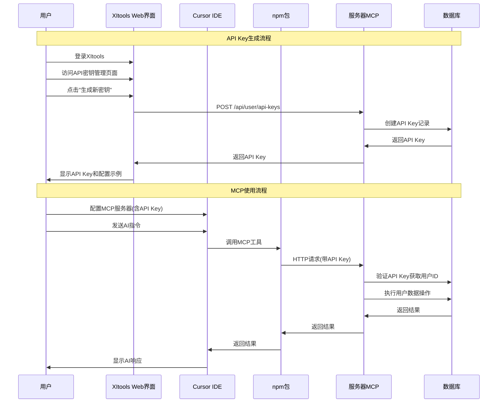

# XItools MCP用户认证系统开发规划

## 项目概述

XItools是一个智能任务看板应用，集成了MCP（Model Context Protocol）服务，提供AI辅助的任务管理体验。本文档详细规划MCP用户认证系统的设计与实现，确保用户数据安全和访问控制。

### 当前架构
```
Cursor → stdio → npm包(furdow-xitools-mcp) → HTTP → 服务器MCP服务 → 数据库
前端Web/应用程序 → 后端API → 数据库
```

### 认证需求
- 确保MCP服务能识别用户身份
- 用户只能操作自己的任务数据
- 支持API Key的生成、管理和撤销
- 提供安全的认证机制

## 1. 认证流程设计

### 1.1 整体认证流程



### 1.2 API Key认证流程

1. **用户生成API Key**
   - 用户在XItools Web界面登录
   - 访问"设置 → API密钥"页面
   - 点击"生成新密钥"，输入密钥名称
   - 系统生成唯一API Key并显示

2. **配置Cursor MCP**
   - 用户复制API Key
   - 在Cursor中配置MCP服务器
   - 将API Key设置为环境变量

3. **MCP请求认证**
   - npm包从环境变量读取API Key
   - 每次HTTP请求都在Authorization头中携带API Key
   - 服务器验证API Key并获取用户身份
   - 基于用户身份执行相应操作

## 2. 数据库设计

### 2.1 用户API密钥表 (user_api_keys)

```sql
CREATE TABLE user_api_keys (
    id UUID PRIMARY KEY DEFAULT gen_random_uuid(),
    user_id UUID NOT NULL REFERENCES users(id) ON DELETE CASCADE,
    name VARCHAR(100) NOT NULL,
    api_key VARCHAR(64) UNIQUE NOT NULL,
    key_prefix VARCHAR(16) NOT NULL, -- 用于显示的前缀，如 "xitool_abc123..."
    permissions JSONB DEFAULT '["mcp:read", "mcp:write"]'::jsonb,
    last_used_at TIMESTAMP,
    last_used_ip INET,
    expires_at TIMESTAMP, -- NULL表示永不过期
    is_active BOOLEAN DEFAULT true,
    created_at TIMESTAMP DEFAULT NOW(),
    updated_at TIMESTAMP DEFAULT NOW(),
    
    -- 索引
    INDEX idx_user_api_keys_user_id (user_id),
    INDEX idx_user_api_keys_api_key (api_key),
    INDEX idx_user_api_keys_active (is_active, expires_at)
);
```

### 2.2 MCP使用日志表 (mcp_usage_logs)

```sql
CREATE TABLE mcp_usage_logs (
    id UUID PRIMARY KEY DEFAULT gen_random_uuid(),
    api_key_id UUID NOT NULL REFERENCES user_api_keys(id) ON DELETE CASCADE,
    user_id UUID NOT NULL REFERENCES users(id) ON DELETE CASCADE,
    tool_name VARCHAR(100) NOT NULL,
    request_params JSONB,
    response_status INTEGER, -- HTTP状态码
    error_message TEXT,
    ip_address INET,
    user_agent TEXT,
    execution_time_ms INTEGER,
    created_at TIMESTAMP DEFAULT NOW(),
    
    -- 索引
    INDEX idx_mcp_logs_user_id_created (user_id, created_at),
    INDEX idx_mcp_logs_api_key_created (api_key_id, created_at),
    INDEX idx_mcp_logs_tool_name (tool_name)
);
```

### 2.3 现有表结构调整

确保所有任务相关表都有用户关联：

```sql
-- 任务表已有user_id字段，无需修改
-- 看板列表需要添加用户关联
ALTER TABLE columns ADD COLUMN user_id UUID REFERENCES users(id);

-- 为现有数据设置默认用户（如果需要）
UPDATE columns SET user_id = (SELECT id FROM users LIMIT 1) WHERE user_id IS NULL;
```

## 3. 前端功能规划

### 3.1 API密钥管理页面

**页面路径**: `/settings/api-keys`

**主要功能**:
- API密钥列表展示
- 创建新密钥
- 查看密钥详情
- 删除密钥
- 使用统计
- 配置示例展示

**页面布局**:
```
┌─────────────────────────────────────────┐
│ API密钥管理                    [新建密钥] │
├─────────────────────────────────────────┤
│ ┌─────────────────────────────────────┐ │
│ │ Cursor MCP密钥        [显示] [删除] │ │
│ │ xitool_abc123...                    │ │
│ │ 创建于: 2024-01-01  最后使用: 今天   │ │
│ │ [查看配置示例]                      │ │
│ └─────────────────────────────────────┘ │
│ ┌─────────────────────────────────────┐ │
│ │ 开发测试密钥          [显示] [删除] │ │
│ │ xitool_def456...                    │ │
│ │ 创建于: 2024-01-02  最后使用: 昨天   │ │
│ └─────────────────────────────────────┘ │
├─────────────────────────────────────────┤
│ 使用说明                                │
│ 1. 点击"新建密钥"创建API密钥            │
│ 2. 复制密钥到Cursor配置文件             │
│ 3. 重启Cursor即可使用XItools功能        │
└─────────────────────────────────────────┘
```

### 3.2 新建密钥对话框

**字段**:
- 密钥名称（必填）
- 权限选择（读取、写入）
- 过期时间（可选）

**生成后显示**:
- 完整API密钥（仅显示一次）
- Cursor配置示例
- 复制按钮

### 3.3 配置示例展示

```json
{
  "mcpServers": {
    "xitools": {
      "command": "npx",
      "args": ["furdow-xitools-mcp@latest"],
      "env": {
        "XITOOLS_API_KEY": "xitool_abc123def456...",
        "XITOOLS_SERVER": "https://xitools.furdow.com"
      }
    }
  }
}
```

## 4. 后端API设计

### 4.1 API密钥管理端点

#### 获取用户API密钥列表
```http
GET /api/user/api-keys
Authorization: Bearer <user_jwt_token>

Response:
{
  "success": true,
  "data": [
    {
      "id": "uuid",
      "name": "Cursor MCP密钥",
      "keyPrefix": "xitool_abc123",
      "permissions": ["mcp:read", "mcp:write"],
      "lastUsedAt": "2024-01-01T10:00:00Z",
      "lastUsedIp": "192.168.1.1",
      "expiresAt": null,
      "isActive": true,
      "createdAt": "2024-01-01T09:00:00Z"
    }
  ]
}
```

#### 创建新API密钥
```http
POST /api/user/api-keys
Authorization: Bearer <user_jwt_token>
Content-Type: application/json

{
  "name": "Cursor MCP密钥",
  "permissions": ["mcp:read", "mcp:write"],
  "expiresAt": null
}

Response:
{
  "success": true,
  "data": {
    "id": "uuid",
    "name": "Cursor MCP密钥",
    "apiKey": "xitool_abc123def456...", // 完整密钥，仅返回一次
    "keyPrefix": "xitool_abc123",
    "permissions": ["mcp:read", "mcp:write"],
    "expiresAt": null,
    "createdAt": "2024-01-01T09:00:00Z"
  }
}
```

#### 删除API密钥
```http
DELETE /api/user/api-keys/:keyId
Authorization: Bearer <user_jwt_token>

Response:
{
  "success": true,
  "message": "API密钥已删除"
}
```

### 4.2 MCP认证端点

#### MCP工具调用统一端点
```http
POST /api/mcp/:toolName
Authorization: Bearer <api_key>
Content-Type: application/json

{
  "params": {
    // 工具参数
  }
}

Response:
{
  "success": true,
  "data": {
    // 工具执行结果
  }
}
```

### 4.3 认证中间件

```javascript
// API Key认证中间件
async function authenticateMCP(request, reply) {
  const authHeader = request.headers.authorization;
  
  if (!authHeader?.startsWith('Bearer ')) {
    return reply.code(401).send({
      success: false,
      error: 'Missing or invalid authorization header'
    });
  }
  
  const apiKey = authHeader.substring(7);
  const keyData = await validateApiKey(apiKey);
  
  if (!keyData) {
    return reply.code(401).send({
      success: false,
      error: 'Invalid API key'
    });
  }
  
  // 更新最后使用时间
  await updateApiKeyUsage(keyData.id, request.ip);
  
  // 将用户信息添加到请求上下文
  request.user = {
    id: keyData.userId,
    apiKeyId: keyData.id,
    permissions: keyData.permissions
  };
}

// API Key验证函数
async function validateApiKey(apiKey) {
  const keyData = await db.query(`
    SELECT ak.id, ak.user_id as "userId", ak.permissions, ak.expires_at as "expiresAt"
    FROM user_api_keys ak
    WHERE ak.api_key = $1 
      AND ak.is_active = true 
      AND (ak.expires_at IS NULL OR ak.expires_at > NOW())
  `, [apiKey]);
  
  return keyData.rows[0] || null;
}
```

## 5. MCP服务改造

### 5.1 现有MCP工具改造

所有MCP工具都需要添加用户身份验证和数据隔离：

#### 改造前（无认证）
```javascript
// 获取所有任务
server.setRequestHandler(CallToolRequestSchema, async (request) => {
  if (request.params.name === 'list_tasks') {
    const tasks = await db.query('SELECT * FROM tasks');
    return { content: [{ type: 'text', text: JSON.stringify(tasks.rows) }] };
  }
});
```

#### 改造后（带用户认证）
```javascript
// 获取用户任务
server.setRequestHandler(CallToolRequestSchema, async (request) => {
  if (request.params.name === 'list_tasks') {
    // 从HTTP请求中获取用户身份
    const userId = await getUserIdFromRequest(request);
    if (!userId) {
      throw new Error('未授权访问');
    }

    const tasks = await db.query(
      'SELECT * FROM tasks WHERE user_id = $1',
      [userId]
    );
    return { content: [{ type: 'text', text: JSON.stringify(tasks.rows) }] };
  }
});
```

### 5.2 用户身份传递机制

由于MCP工具运行在服务器端，需要将HTTP请求中的用户身份传递给MCP工具：

```javascript
// MCP HTTP端点处理
app.post('/api/mcp/:toolName', authenticateMCP, async (request, reply) => {
  const { toolName } = request.params;
  const userId = request.user.id;

  // 调用MCP工具，传递用户身份
  const result = await mcpServer.callTool(toolName, {
    ...request.body,
    _userId: userId, // 内部传递用户ID
    _permissions: request.user.permissions
  });

  return result;
});

// MCP工具内部处理
server.setRequestHandler(CallToolRequestSchema, async (request) => {
  const { name, arguments: args } = request.params;
  const userId = args._userId; // 获取用户ID
  const permissions = args._permissions;

  // 检查权限
  if (!permissions.includes('mcp:read') && name.startsWith('get_')) {
    throw new Error('无读取权限');
  }

  if (!permissions.includes('mcp:write') && ['create_', 'update_', 'delete_'].some(p => name.startsWith(p))) {
    throw new Error('无写入权限');
  }

  // 执行工具逻辑，确保只操作用户数据
  return await executeToolWithUser(name, args, userId);
});
```

### 5.3 需要改造的MCP工具列表

1. **任务管理工具**
   - `list_tasks` - 只返回用户任务
   - `get_task_details` - 验证任务所有权
   - `submit_task_dataset` - 创建任务时设置用户ID
   - `update_task` - 验证任务所有权
   - `delete_task` - 验证任务所有权
   - `clear_all_tasks` - 只清除用户任务

2. **列管理工具**
   - `get_columns` - 只返回用户列
   - `create_column` - 创建列时设置用户ID
   - `update_column` - 验证列所有权
   - `delete_column` - 验证列所有权
   - `reorder_columns` - 验证列所有权

## 6. 安全考虑

### 6.1 API Key生成安全

```javascript
// 安全的API Key生成
function generateApiKey() {
  const prefix = 'xitool_';
  const randomBytes = crypto.randomBytes(32); // 256位随机数
  const keyBody = randomBytes.toString('hex');
  return prefix + keyBody;
}

// API Key哈希存储（可选，增强安全性）
function hashApiKey(apiKey) {
  return crypto.createHash('sha256').update(apiKey).digest('hex');
}
```

### 6.2 传输安全

- **HTTPS强制**: 所有API请求必须使用HTTPS
- **请求头验证**: 验证Authorization头格式
- **速率限制**: 防止API Key暴力破解

```javascript
// 速率限制中间件
const rateLimiter = rateLimit({
  windowMs: 15 * 60 * 1000, // 15分钟
  max: 1000, // 每个API Key最多1000次请求
  keyGenerator: (request) => {
    const apiKey = request.headers.authorization?.substring(7);
    return apiKey || request.ip;
  },
  message: {
    success: false,
    error: '请求过于频繁，请稍后再试'
  }
});
```

### 6.3 存储安全

- **API Key加密存储**（可选）
- **定期清理过期密钥**
- **审计日志记录**

```javascript
// 定期清理过期密钥
async function cleanupExpiredKeys() {
  await db.query(`
    UPDATE user_api_keys
    SET is_active = false
    WHERE expires_at < NOW() AND is_active = true
  `);
}

// 记录使用日志
async function logMCPUsage(apiKeyId, userId, toolName, params, status, error) {
  await db.query(`
    INSERT INTO mcp_usage_logs
    (api_key_id, user_id, tool_name, request_params, response_status, error_message, ip_address, user_agent)
    VALUES ($1, $2, $3, $4, $5, $6, $7, $8)
  `, [apiKeyId, userId, toolName, params, status, error, request.ip, request.headers['user-agent']]);
}
```

## 7. 用户使用指南

### 7.1 完整使用流程

#### 步骤1: 注册和登录XItools
1. 访问 https://xitools.furdow.com
2. 注册新账号或使用现有账号登录
3. 创建工作区和看板，熟悉基本功能

#### 步骤2: 生成API密钥
1. 点击右上角头像 → "设置"
2. 在左侧菜单选择 "API密钥"
3. 点击 "新建密钥" 按钮
4. 输入密钥名称（如："Cursor MCP"）
5. 选择权限（建议选择"读取"和"写入"）
6. 点击 "生成密钥"
7. **重要**: 立即复制API密钥，关闭对话框后无法再次查看

#### 步骤3: 配置Cursor MCP
1. 打开Cursor IDE
2. 按 `Ctrl/Cmd + Shift + P` 打开命令面板
3. 输入 "MCP" 找到MCP设置
4. 在MCP配置文件中添加以下内容：

```json
{
  "mcpServers": {
    "xitools": {
      "command": "npx",
      "args": ["furdow-xitools-mcp@latest"],
      "env": {
        "XITOOLS_API_KEY": "你的API密钥",
        "XITOOLS_SERVER": "https://xitools.furdow.com"
      }
    }
  }
}
```

#### 步骤4: 重启Cursor并测试
1. 重启Cursor IDE
2. 在聊天窗口输入："帮我列出所有任务"
3. 如果配置正确，AI将显示你的任务列表

### 7.2 常见问题解决

**Q: API密钥无效怎么办？**
A: 检查密钥是否完整复制，确认密钥未过期，在XItools设置中重新生成

**Q: Cursor无法连接MCP服务？**
A: 检查网络连接，确认服务器地址正确，查看Cursor控制台错误信息

**Q: 权限不足错误？**
A: 检查API密钥权限设置，确保包含所需的读取/写入权限

### 7.3 最佳实践

1. **密钥管理**
   - 为不同用途创建不同密钥
   - 定期轮换API密钥
   - 不要在代码中硬编码密钥

2. **安全使用**
   - 不要分享API密钥
   - 发现密钥泄露立即删除
   - 使用最小权限原则

3. **故障排除**
   - 查看XItools使用日志
   - 检查Cursor MCP连接状态
   - 联系技术支持

## 8. 开发任务分解

### 8.1 第一阶段：基础认证功能（优先级：高）

**预估工作量**: 5-7个工作日

#### 后端任务
- [ ] **数据库设计** (0.5天)
  - 创建user_api_keys表
  - 创建mcp_usage_logs表
  - 添加必要索引

- [ ] **API密钥管理API** (2天)
  - 实现创建API密钥接口
  - 实现获取密钥列表接口
  - 实现删除密钥接口
  - 添加认证中间件

- [ ] **MCP认证集成** (2天)
  - 修改MCP HTTP端点添加认证
  - 实现用户身份传递机制
  - 改造现有MCP工具添加用户过滤

#### 前端任务
- [ ] **API密钥管理页面** (2天)
  - 设计和实现密钥列表界面
  - 实现新建密钥对话框
  - 添加配置示例展示
  - 集成到设置页面

#### 测试任务
- [ ] **功能测试** (0.5天)
  - API接口测试
  - 前端界面测试
  - MCP认证流程测试

### 8.2 第二阶段：安全增强（优先级：中）

**预估工作量**: 3-4个工作日

- [ ] **安全功能** (2天)
  - 实现速率限制
  - 添加使用日志记录
  - 实现密钥过期机制

- [ ] **监控和管理** (1天)
  - 添加使用统计展示
  - 实现异常使用检测
  - 添加管理员密钥管理功能

- [ ] **文档和指南** (1天)
  - 完善用户使用指南
  - 编写API文档
  - 创建故障排除指南

### 8.3 第三阶段：优化和扩展（优先级：低）

**预估工作量**: 2-3个工作日

- [ ] **用户体验优化** (1天)
  - 优化密钥生成流程
  - 添加一键生成配置json按钮
  - 改进错误提示信息

- [ ] **高级功能** (1-2天)
  - 实现权限细分控制
  - 添加密钥使用分析
  - 支持团队密钥管理

### 8.4 开发里程碑

- **里程碑1** (第1周): 完成基础认证功能，用户可以生成和使用API密钥
- **里程碑2** (第2周): 完成安全增强，系统具备生产环境安全要求
- **里程碑3** (第3周): 完成优化扩展，提供完整的企业级功能

### 8.5 风险评估

**技术风险**:
- npm包与服务器通信的稳定性
- MCP工具改造的兼容性问题

**缓解措施**:
- 充分测试npm包在不同环境下的表现
- 保持MCP工具API的向后兼容性
- 实现详细的错误日志和监控

**时间风险**:
- MCP工具改造可能比预期复杂

**缓解措施**:
- 优先改造核心工具
- 分批次发布功能
- 预留缓冲时间

---

## 总结

本文档详细规划了XItools MCP用户认证系统的设计与实现。通过API Key认证机制，确保用户数据安全和访问控制，同时保持良好的用户体验。

关键特性：
- 🔐 安全的API Key认证机制
- 👥 完整的用户数据隔离
- 🎯 直观的密钥管理界面
- 📊 详细的使用日志和监控
- 🚀 简单的配置和使用流程

按照本规划实施，将为XItools提供企业级的MCP认证解决方案，支持安全、可控的AI辅助任务管理体验。
